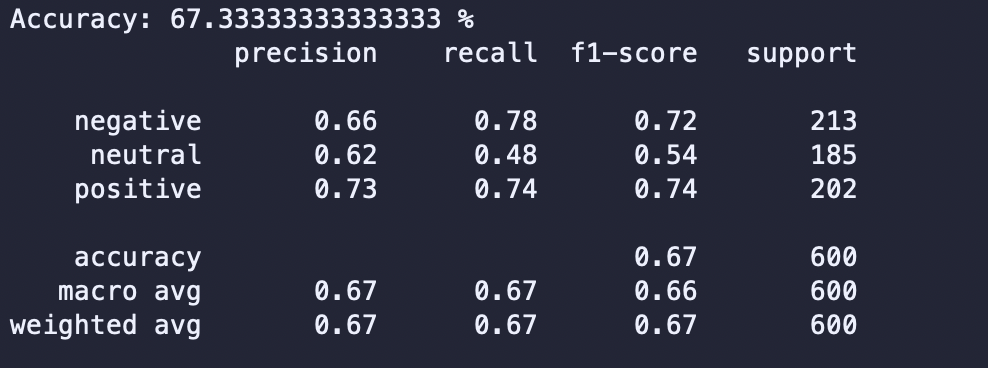
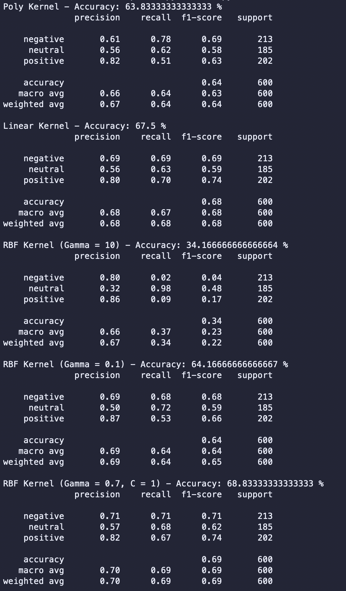
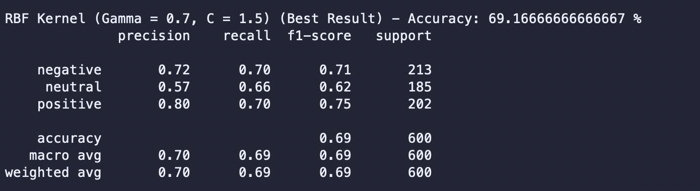
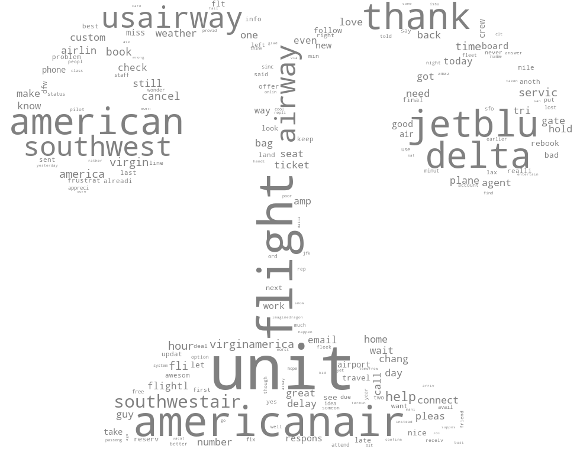
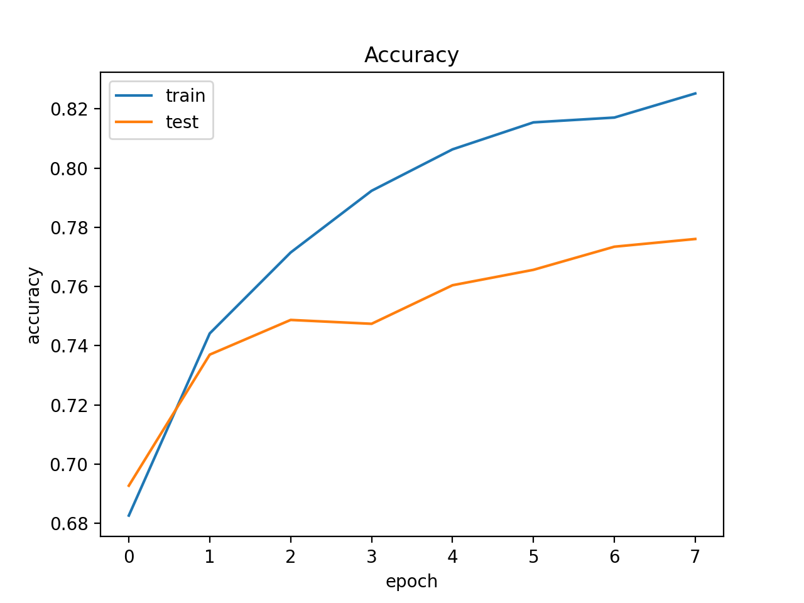
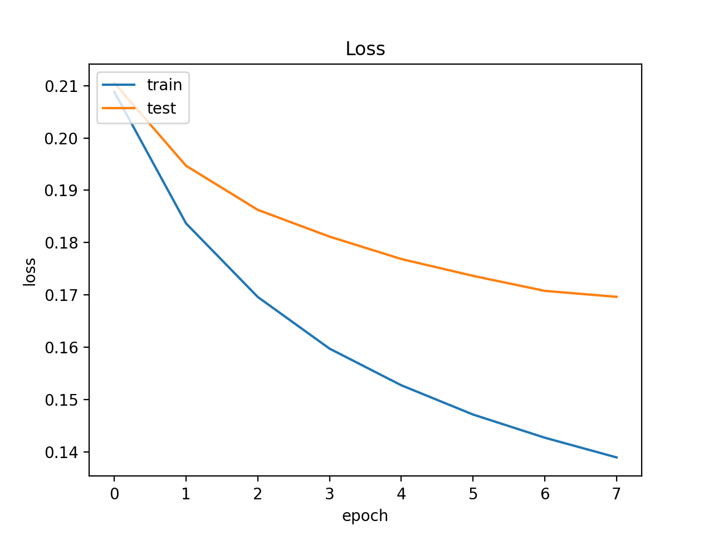
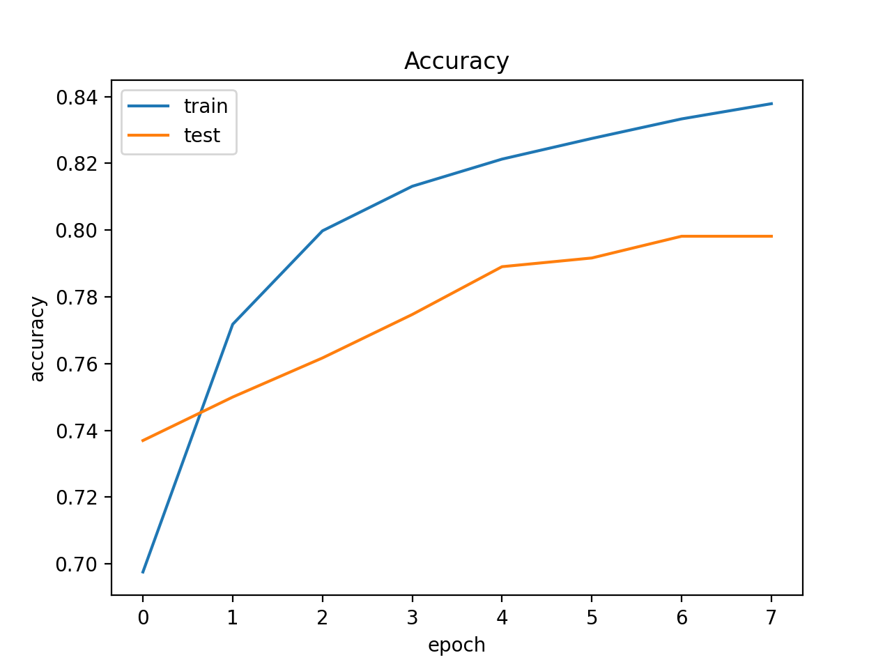
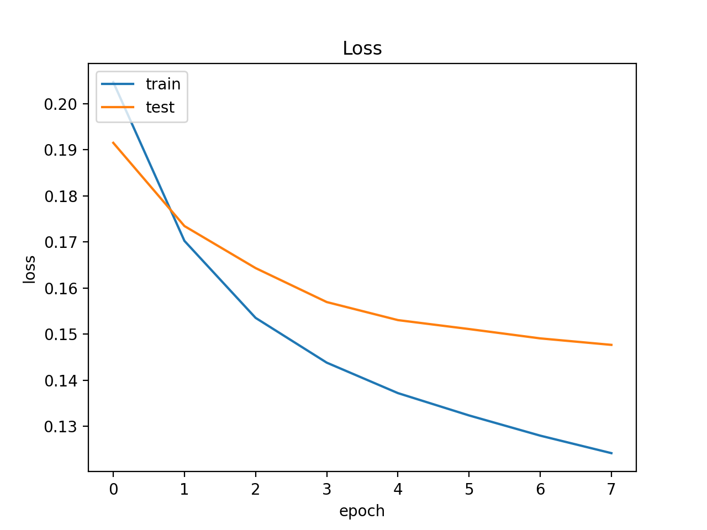
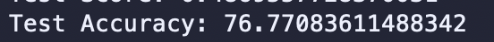
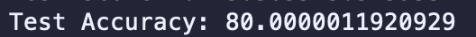

# Performance Comparison between Support Vector Machine, Naive Bayes Classifier, Sequential Model, and Convolutional Neural Network for Text Dataset Sentiment Analysis
Project Team Members: Aamod Khatiwada, Nitisha Patange, Humberto Pinon

You can find the poster presentation of this project here: [file/Aamod-Khatiwada_Nitisha-Patange_Humberto-Pinon_project_poster.pdf](file/Aamod-Khatiwada_Nitisha-Patange_Humberto-Pinon_project_poster.pdf).

## Dataset

The dataset was obtained from [kaggle](https://www.kaggle.com/). The dataset used was [Twitter US Airline sentiment](https://www.kaggle.com/crowdflower/twitter-airline-sentiment).

## What's Included

Within the download you'll find the following directories and files:

```text
sourcecode/
└── data/
    ├── dl.csv
    ├── naive_bayes_results.csv
    ├── svm_results.csv
    ├── test.csv
    ├── training.csv
└── file/
    ├── Aamod-Khatiwada_Nitisha-Patange_Humberto-Pinon_project_poster.pptx
└── img/
    ├── minus.png
    ├── model_1_accuracy.png
    ├── model_1_loss.png
    ├── model_2_accuracy.png
    ├── model_2_loss.png
    ├── nb_actual_negative.png
    ├── nb_actual_neutral.png
    ├── nb_actual_positive.png
    ├── nb_predicted_negative.png
    ├── nb_predicted_neutral.png
    ├── nb_predicted_positive.png
    ├── nb_results.png
    ├── negative_mask.jpg
    ├── neutral_mask.jpg
    ├── neutral_pic.png
    ├── plus.png
    ├── positive_mask.jpg
    ├── svm_actual_negative.png
    ├── svm_actual_neutral.png
    ├── svm_actual_positive.png
    ├── svm_predicted_negative.png
    ├── svm_predicted_neutral.png
    ├── svm_predicted_positive.png
    ├── svm_results_1.png
    ├── svm_results_2.png
    ├── test_accuracy_model_1.png
    ├── test_accuracy_model_2.png
├── dl.py
├── LICENSE
├── nb.py
├── README.md
├── svm.py
├── wc_nb.py
├── wc_svm.py
```

## Getting Started

### Prerequisites

* python >= 3.8.1
* pandas >= 1.0.3
* sklearn
* image >= 1.5.31
* wordcloud >= 1.7.0
* keras >= 2.3.1
* tensorflow >= 2.2.0
* Download [file](https://www.kaggle.com/terenceliu4444/glove6b100dtxt). Rename it ```glove.txt```. After that, add it to the ```data/``` folder.

## Usage

### Naive Bayes

In order to obtain the Naive Bayes results one has to run ```nb.py```:

```bash
python nb.py
```

At the end of running ```nb.py```, the results (accuracy, precision, etc.) will show up on the terminal. Also, ```data/naive_bayes_results.csv``` will be created and will include the actual and predicted values for each tweet.

Here is what the terminal should show as output at the end of running ```nb.py```:



#### Word Cloud

In order to see the word cloud obtained from the Naive Bayes code, one has to run ```wc_nb.py```

```bash
python wc_nb.py
```

The results will be shown while running the code. The output will be similar to the following images:

* Naive Bayes Results - Actual Positive

* Naive Bayes Results - Actual Neutral

* Naive Bayes Results - Actual Negative

* Naive Bayes Results - Predicted Positive

* Naive Bayes Results - Predicted Neutral

* Naive Bayes Results - Predicted Negative


### SVM

In order to obtain the SVM results one has to run ```svm.py```:

```bash
python svm.py
```

At the end of running ```svm.py```, the results (accuracy, precision, etc.) will show up on the terminal. Also, ```data/svm_results.csv``` will be created and will include the actual and predicted values for each tweet.

Here is what the terminal should show as output at the end of running ```svm.py```:




#### Word Cloud

In order to see the word cloud for the best result paramaters obtained from the SVM code, one has to run ```wc_svm.py```

```bash
python wc_svm.py
```

The results will be shown while running the code. The output will be similar to the following images:

* SVM Results - Actual Positive

* SVM Results - Actual Neutral

* SVM Results - Actual Negative

* SVM Results - Predicted Positive

* SVM Results - Predicted Neutral

* SVM Results - Predicted Negative


### Deep Learning

In order to obtain the Deep Learning results one has to run ```dl.py```:

```bash
python dl.py
```

At the end of running ```dl.py```, the output will show graphs for accuracy and loss comparing the training and test on a graph for both models. It will also show the percentage of the accuracy for both models.

Here is what the terminal should show as output at the end of running ```dl.py```:

* Accuracy Graph of First Model

* Loss Graph of First Model

* Accuracy Graph of Second Model

* Loss Graph of Second Model

* Test Accuracy of First Model

* Test Accuracy of Second Model
